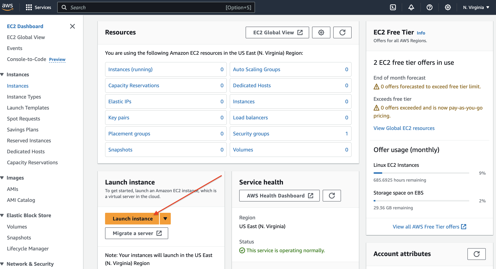
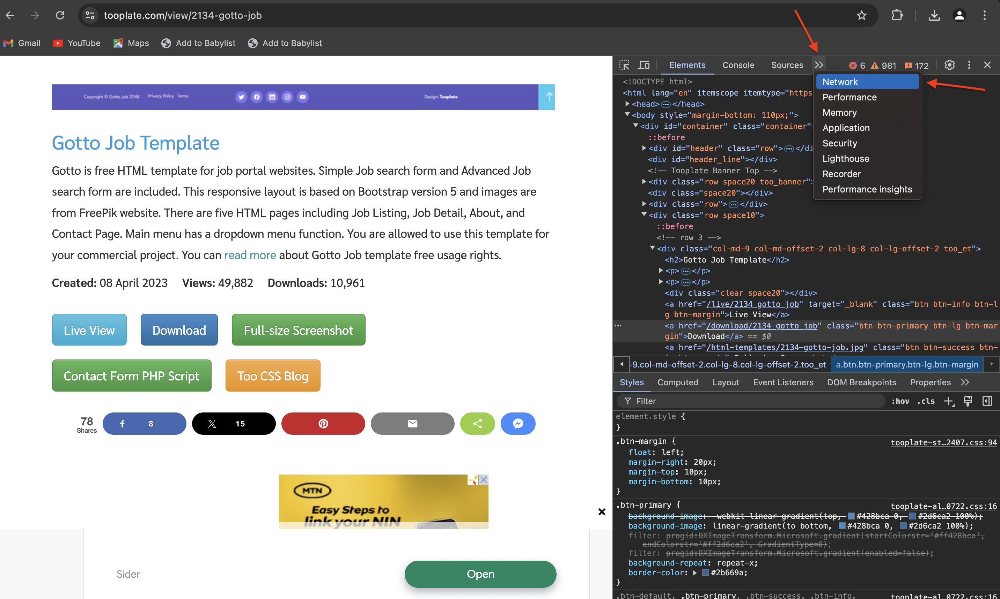
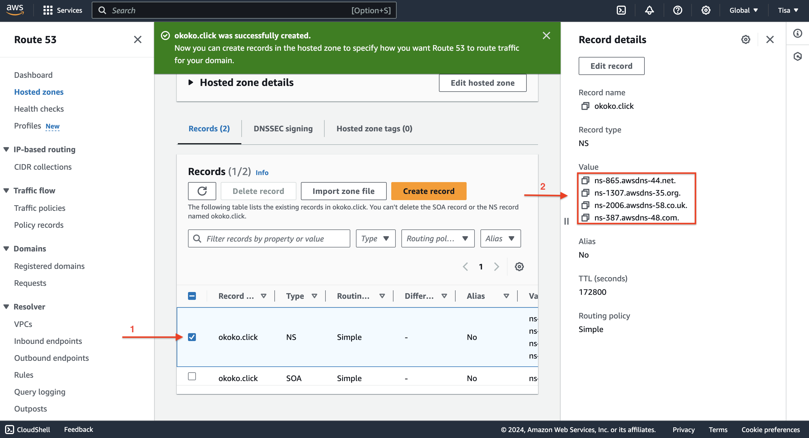

# Setting up a Static Website Using Nginx

## In this project, we'll be;

* Opening and Setting up an AWS account budget.

* Buying a domain name of our choice. We'll be using namecheap.com for this purchase.

* Configuring An EC2 instance which is a virtual server in AWS cloud. With this, we will request and provision a computer server(linux/ubuntu) within the AWS cloud.

* Building with Nginx: Which is the engine that delivers website contents to the world.

* Downloading HTML website template (We'll be using a free site called Tooplate.com).

* Connecting our domain with Amazon Route53 Which is the DNS service that directs visitors to website's location.

* Securing the website with CErtbot: Ensures secured connection for the website. Which is implementing HTTPS encryption using Certbot.

## OPENING AND SETTING UP AN AWS ACCOUNT BUDGET

* Input my email address as root user and chose a name(I used Tisa) for the AWS account name.

* Signed in, clicked on the name(Tisa) at the top right corner. A drop down with a list of clickable options appeared and I clicked on Billings and Cost Management.

* At the left hand tab, scrolled down to Budgets and planning and clicked on Budgets.

* Clicked on create a budget, wit took me  to budget type.

* We will be creating a zero spend budget, so leave budget setup template as simplified and also leave the zero spend budget ticked. Input your email address to be notified if you pass the threshold and click on create budget.

## BUYING A DOMAIN NAME 

### *We can purchase a domain name from a variety of domain sites e.g;*

- namecheap.com
- godaddy.com
- porkburn.com
- cloudfare.com
- domain.com

And so many more. For this exercise, I bought from namecheap.com because of it's  user friendly interphase.

* www.namecheap.com and I registered.

* Logged in clicked on Domains/Domains search

* Searched with any name of my choice. I decided to search for the cheapest I could get, so I avoided the (.com/.co.uk) and the likes and went for a (.click).

a. 

b.

## CONFIGURING AN EC2 INSTANCE (LINUX/UBUNTU) SEVER ON AWS

* Logged into my Aws management console, searched and clicked EC2 .....

* Clicked on Launch instance 

* Named my project(ProjectA) and selected Ubuntu under the Applications and Os images (AMI)

* Clicked the ***Create new key pair*** button to generate a key pair for a secure connection to my instance.

* Entered a Key pair name and clicked on create key pair.

* Enabled SSH, HTTP, and HTTPS access, then proceeded to click Launch instance.

 ### Note: For security reasons,I restricted SSH access to my custom IP address.

* Clicked on View all instances.

* Clicked on the created instance

* Clicked on the Connect button.

* Copied the command provided under SSH client.

* Opened my terminal,(cd) to the directory where the .pem file was downloaded(Downloads folder), entered the ***chmod 400*** command then pasted the ssh command and pressed Enter.

### Note: All commands related to the EC2 instance will be executed in the terminal where the .pem file is located.

## Created and Assigned an Elastic IP

* Returned to AWS console and clicked on the menu icon at the top lefthand side to open the dashboard menu.

* Selected Elastic IPs under Network & Security.

* Clicked on Allocate ELastic IP address button.

* Left the settings Unchanged and proceeded to clicked ***Allocate***

* Clicked on Associate the Elastic IP address.

* Selected the instance to associate with the elastic IP address, then clicked on Associate.

### Note: The IP address for my instance have been updated to the elastic IP associated with it. Therefore, I had to SSH into my instance again. Returned to the instance connection page and copied the new command.

* Pasted the command into my terminal and pressed enter. When prompted , I typed "***yes***" and pressed enter to connect.

## Building with Nginx: Installing Nginx and setting up the webaite

* Executed the following commands in my terminal;

- ***sudo apt update***

- ***sudo apt upgrade***

- ***sudo apt install nginx***

* ### Then started the Nginx server by running these commands also

- ***sudo systemctl start nginx***

- ***sudo systemctl enable nginx (enables to statrt on boot)***

- ***sudo systemctl status nginx  (status confirmation)***

* Went back to the EC2 dashboard and copied my Public IPv4 address.

* Pasted my Public IPv4 address in a web browser to view the default Nginx startup page.

## Downloaded my preffered HTML website template from Tooplate.com

* Opened www.tooplate.com

* Chose my preffered template, scrolled down to download, right clicked on it and clicked on inspect

* Selected the Network tab

* Clicked on download button while watching closely for the .zip file in the Network/doc section. Right clicked and copied the url of the .zip file.

* Pasted the url in my notepad.

* Went back to my terminal to run these commands;

- ***cd /var/www/html***

- ***sudo curl -o /var/www/html/2134_gotto_job.zip https://www.tooplate.com/zip-tempalates/2134_gotto_job.zip***

### note: This downloaded the website files to my html directory.

- ***sudo apt update***

- ***sudo apt upgrade***

- ***sudo apt install unzip***

* Unzipped the contents of the website by running this command;

- ***sudo unzip 2134_gotto_job.zip***

* Then I ran this command to update the Nginx configuration;

- ***sudo nano /etc/nginx/sites-available/default***

* Edited the root directory within my server block where my downloaded website contents are stored and updated it.

***Before***

***After***

* Restarted the Nginx to apply the changes by running this command;

- ***sudo systemctl restart nginx***

* Opened the web browser, pasteds my ***public IPv4 address or Elastic IP address*** to confirm that my website works as expected.

### Created An A Record:

 ***This is changing my website's accessibility from the IP address to the domain name.***

* I set up a DNS record. By using the domain name(okoko.click) i bought from www.namecheap.com. CLicked on manage

* I moved the hosting to ***AWS ROUTE 53*** where i set uo an ***A record*** Went back to my AWS console, searched and clicked on Route 53 from the drop down.

* Clicked on Get Started

* Selected Create Hosted zones and clicked on Get Started.

* Entered my Domain name(okoko.click) ***(1)***, chose public hosted zone ***(2)*** then i clicked create hosted zone ***(3)***.

* Selected the created hosted zone ***(1)*** so I could access the nameservers ***(2)***

* Went back to my Domain registrar(namecheap.com) okoko.click (clicked manage) and selected custom DNS to access and add the ***nameservers*** taken from Amazon Route 53.. Then Saved

* Went back to my AWS console and clicked on Create record.

* Pasted my Elastic IP address/IPv4 public address and then clicked on ***create records***

* My A record has been successfully created. Clicked on create record again to create record for my sub doamin.

* I input the record name (www), pasted my IP address, and then clicked on Create records.

***Note***: I made sure I created DNS records for both my root main domain(okoko.click) and sudmain(www.okoko.click). So that both domains are accessible. Both reords will direct traffic to my IP address.

* Opened my terminal and ran this command to edit my settings;

* ***sudo nano /etc/nginx/sites-available/default***

***Before***

* I entered my domain and subdomain names and saved the changes.

***After***

* Restarted my nginx server by running this command;

***sudo systemctl retart nginx***

* Pasted my domain in a web browser to verify that my website is accessible.

***Note***: I noticed the sign that says ***NOT SECURE***. So I used certbot to obtian the SSL certificate necessary to enable HTTPS on my site.

### Installed Certbot and Requested for an SSL/TLS Certficate

* To intall certbot, I executed the follwoing commands;

- ***sudo apt update***

- ***sudo apt install certbot python3-certbot-nginx***

- ***sudo cerbot --nginx*** 

***This command requested my certificate. I followed the instructions provided by certbot and selected the domain names for HTTPS activation***

* Verified the website's SSL using the OpenSSL utility with this command;

- ***openssl s_client -connect okoko.click:443***

* Visited ***okoko.click/www.okoko.click*** to view my website.

## THE END OF PROJECT

